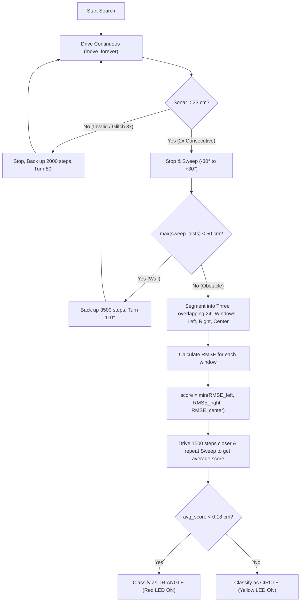

# Obstacle Mapping and Classification Strategy (Task 2)

This document details the strategy, geometric analysis, and implementation details for locating and identifying whether the environment's obstacle is a **circular disk** or a **triangle** using a single forward-facing sonar sensor, in a 120 cm x 120 cm environment.

## 1. Geometric Concept
A circle and a triangle interact differently with a sweeping sonar beam:

### Flat Sides vs. Curved Surface
* **Flat Side (Triangle)**: When the sonar sweeps across a flat surface, the distance $d(\theta)$ is given by:
  $$d(\theta) = \frac{d_{\text{min}}}{\cos(\theta)}$$
  In Cartesian coordinates relative to the closest point, these points satisfy $y = \text{constant}$ (a straight line). Fitting a straight line to these points yields a root-mean-square error (RMSE) of **$0.0\text{ cm}$** (noise-free).
* **Curved Surface (Circle)**: The circle's profile is curved. In Cartesian coordinates, the points form a curved arc. Fitting a straight line to this arc yields a large RMSE of **$\approx 0.226\text{ cm}$** (over a $24^\circ$ window).

## 2. Navigation and Exploration (Startup & Search)
To save time and simplify execution, the robot does not perform a slow 360-degree startup scan:
1. It immediately begins driving straight from its starting orientation.
2. If it starts in a corner facing a wall, it will immediately detect the wall ($d < 33\text{ cm}$), perform a sweep, identify it as a wall, and bounce (back up 19 cm and turn $110^\circ$).
3. This "bounce" automatically orientates the robot away from the walls and towards the center search space.

## 3. High-Frequency Safety Driving Loop
To prevent the robot from crashing into walls or obstacles, the motors are run continuously while the sonar is polled at high frequency (~20 Hz / every 50ms):
* **No-Blocking Driving**: The motors run in the background using `move_forever()`, rather than blocking the async loop with step intervals.
* **Continuous Polling**: Sonar is read using a fast 3-sample median filter (`get_filtered_sonar(samples=3)`), which takes under 30-50ms and filters out single-point spike noise.
* **Double-Check Verification**: When a distance $< 33\text{ cm}$ is detected, the robot takes a second reading immediately. If both consecutive readings are $< 33\text{ cm}$, the robot halts immediately. This prevents stopping on transient glitches while guaranteeing a response time under 100-200ms.
* **Persistent Glitch Recovery**: If the sonar returns invalid readings (`None`) for 8 consecutive checks (~0.5s), the robot stops, backs up 11 cm, turns $80^\circ$ to find a better angle of reflection, and resumes searching.

## 4. Double Filtering for Sonar Glitches
To handle the various sonar error modes, we implement two layers of software filtering:
1. **Double-Check Verification (Driving)**: Eliminates stopping on single transient low-value glitches when driving straight.
2. **Spatial Outlier Filter (Rotation Sweeps)**: When performing angular sweeps, it checks adjacent values. If a point is a local anomaly (sudden dip or peak relative to both neighbors by $> 12\text{ cm}$), it is discarded before geometry calculations to ensure line-fitting accuracy.

## 5. Obstacle vs. Wall Detection
Because the obstacle is very wide relative to a 120 cm x 120 cm room (50 cm diameter bin or triangle side), a $60^\circ$ sweep at 30 cm distance will not easily see past the sides to the background. However:
* **Arena Wall**: A flat wall. The maximum distance in the sweep will remain extremely small:
  $$\max(d) \le \frac{33}{\cos(30^\circ)} \approx 38.1\text{ cm} \le 50.0\text{ cm}$$
* **Obstacle**: The edges curve away or end, so the maximum distance measured at the outer sweep angles will exceed 50.0 cm (detecting the far background).

## 6. Indication
* **Yellow LED (GP11)**: Turned ON if classified as a **Circle**.
* **Red LED (GP10)**: Turned ON if classified as a **Triangle**.
